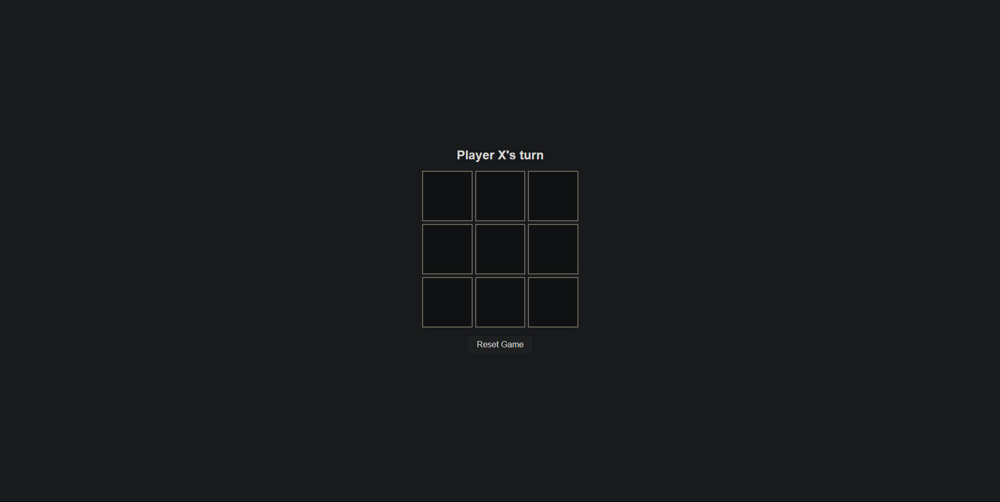
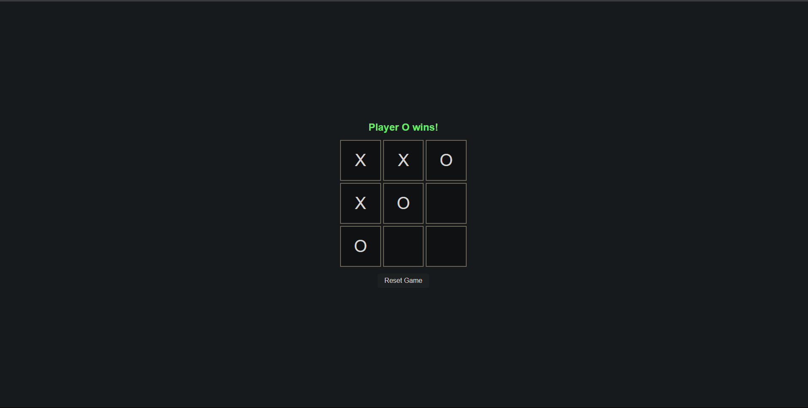

# 🎮 Tic-Tac-Toe Game (HTML, CSS, JavaScript)

A clean, responsive two-player **Tic-Tac-Toe** game built using vanilla HTML, CSS, and JavaScript. Designed to be simple, fun, and mobile-friendly — with subtle animations for winners and ties.


## 🚀 Features

- 🔹 Two-player turn-based gameplay (X and O)
- 🔹 Win detection (row, column, diagonal)
- 🔹 Tie detection
- 🔹 Winner animation (flash effect)
- 🔹 Tie animation (pulse effect)
- 🔹 Game reset button
- 🔹 Responsive layout for desktop and mobile
  

## 🧱 Technologies Used

- **HTML5** – Game structure
- **CSS3** – Styling and animations
- **JavaScript (ES6)** – Game logic and interactivity


## 🖼️ Game Interface

- 3×3 grid board for Tic-Tac-Toe
- Display area showing current player or result (win/tie)
- Reset button to start a new round


## ▶️ How to Run the Game Locally

1. Clone the repository:
   ```bash
   git clone https://github.com/your-username/tic-tac-toe.git
   cd tic-tac-toe
2. Open index.html in your browser:

- Double-click it
(OR)
- Run with Live Server (if using VS Code)


## 🧠 Game Logic Overview
- Board is a 3x3 matrix stored in memory
- Players alternate turns between X and O
- After each move, script checks for:
- A win: 3 matching symbols in a row/col/diagonal
- A tie: All cells filled with no winner
- Winner or tie triggers animation and disables further moves
- Reset button clears board and starts fresh


## 📸 Screenshots





## 🧑‍💻 Author
GitHub: @BhangaleGunjan


## 📄 License
This project is open source and available under the MIT License.
